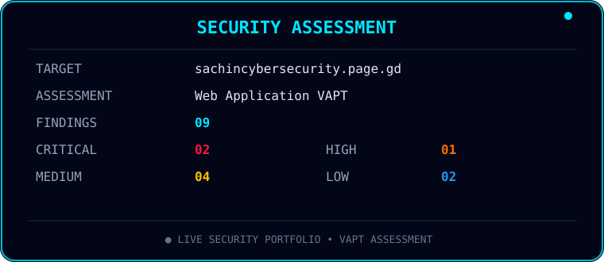

<!-- ========================================================= -->
<!--                    ANIMATED HEADER                       -->
<!-- ========================================================= -->

  

<!-- ========================================================= -->
<!--                    TYPING EFFECT                         -->
<!-- ========================================================= -->

  

---

# 🛡️ MY WEBSITE SECURITY REPORT

> **A hands-on Web Application Vulnerability Assessment & Penetration Testing report for my own cybersecurity portfolio website.**

  

